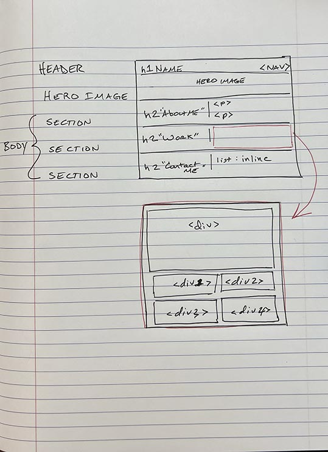

# challenge-2
Challenge 2 - Create a Portfolio

Given only the below animated gif for a mockup, the goal was to create a portfolio web page for the user story and acceptance criteria. 

## Mock-Up

The following animation shows the web application's appearance and functionality:


## User Story

```
AS AN employer
I WANT to view a potential employee's deployed portfolio of work samples
SO THAT I can review samples of their work and assess whether they're a good candidate for an open position
```
## Acceptance Criteria

Here are the critical requirements necessary to develop a portfolio that satisfies a typical hiring manager’s needs:

```
GIVEN I need to sample a potential employee's previous work
WHEN I load their portfolio
THEN I am presented with the developer's name, a recent photo or avatar, and links to sections about them, their work, and how to contact them
WHEN I click one of the links in the navigation
THEN the UI scrolls to the corresponding section
WHEN I click on the link to the section about their work
THEN the UI scrolls to a section with titled images of the developer's applications
WHEN I am presented with the developer's first application
THEN that application's image should be larger in size than the others
WHEN I click on the images of the applications
THEN I am taken to that deployed application
WHEN I resize the page or view the site on various screens and devices
THEN I am presented with a responsive layout that adapts to my viewport
```

## Process

First, I drew wireframes showing the layout of the webpage. 



Second, I created a very basic HTML outline for the Header, Body, and 3 Sections. Then, I created classes and used @media commands to ensure responsive layout for the section headers and contact info.

Next, I started at the top and worked down the page completing the Header, Nav, Hero Image, "About Me" and "Contact Me." I knew the section with links to sample work would be the hardest, so I saved it for last. 

## Collaborators
None

## License
MIT License

## References

Hero Image
https://www.w3schools.com/howto/howto_css_hero_image.asp

Header 
https://www.educative.io/answers/how-to-change-the-size-of-the-header-in-css

Section Spacing
https://stackoverflow.com/questions/8010120/specifying-exact-percentage-widths-in-relation-to-parent-div-in-css

List Spacing
https://stackoverflow.com/questions/23226888/horizontal-list-items-fit-to-100-with-even-spacing

## Photo Credits
Mountain photo by Chris Valada.

Computer photo by <a href="https://unsplash.com/@clemhlrdt?utm_source=unsplash&utm_medium=referral&utm_content=creditCopyText">Clément Hélardot</a> on <a href="https://unsplash.com/photos/95YRwf6CNw8?utm_source=unsplash&utm_medium=referral&utm_content=creditCopyText">Unsplash</a>
  